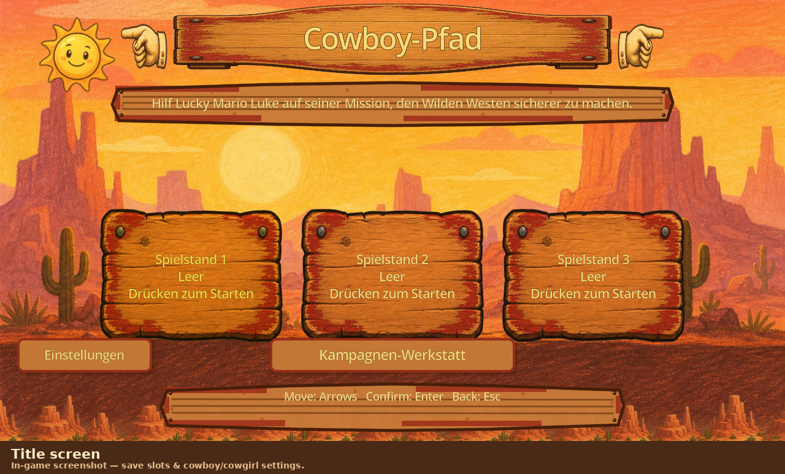
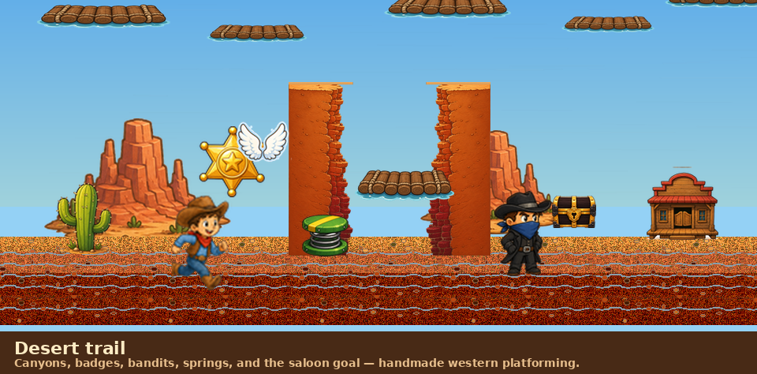
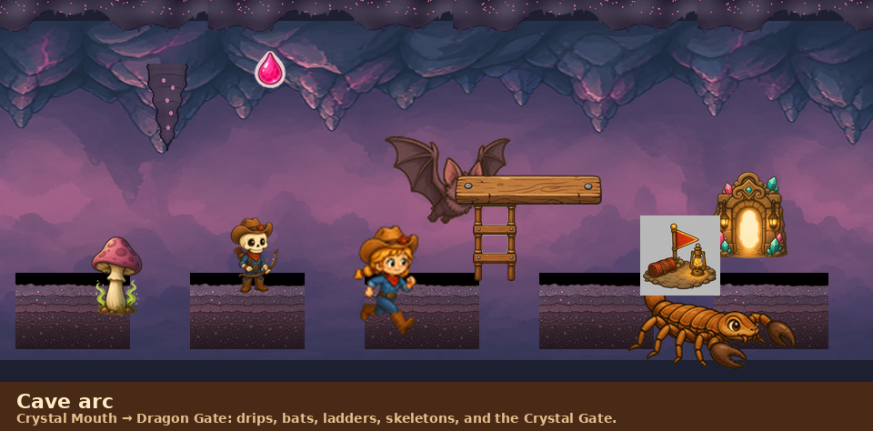
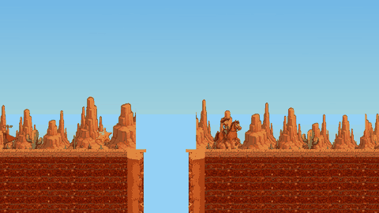
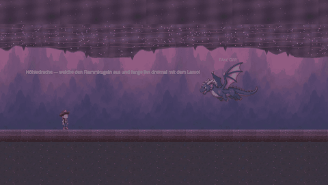
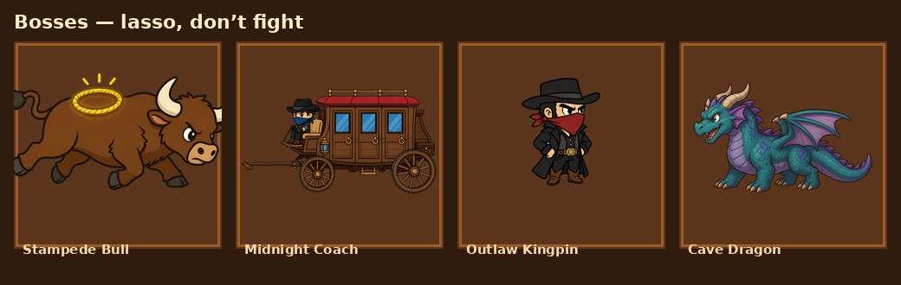

# Cowboy Trail

Child-friendly 2D western cowboy platformer (Godot **4.4**). Aimed at kids ~6: forgiving jumps, nonviolent lasso. **Classic mode** has no lives or game over; **Advanced Mode** (hearts button on the start screen, or **Settings**) has four badge paces — **★5 / ★10 / ★15 / ★30** sheriff badges for each extra life. ★5 and ★10 start with **5 hearts**; ★15 and ★30 start with **3**. Cycle the hearts button or pick a row in Settings before starting or continuing a slot. Pick **Cowboy** or **Cowgirl** on the start screen (or in Settings) — each **save slot** stores its own rider and Classic/Advanced trail mode; focusing a filled door restores that slot’s picks, and starting/continuing commits the current picks to that slot. **German is the default language**; English is fully supported.

**Content version:** `1.8.85` (see `content_version.txt`). Launchers reimport when this stamp changes.

This README is the **binding source of truth** for gameplay, level design, art, i18n, and audio. Agents and contributors must follow it (see [Agent / contributor rules](#agent--contributor-rules)).

---

## See the game

Stills and loops below are **screenshots from the running game** (Godot viewport capture → `docs/showcase/`). Refresh with:

```bash
python3 tools/build_readme_showcase.py
```

Needs a real display (not `--headless`). Capture-only scene: `godot --path . res://tools/capture_readme_screenshots.tscn`.

### Title & trails







### Motion (in-game GIF loops)

| Horse on the desert trail | Cave Dragon fight |
|:---:|:---:|
|  |  |

### Bosses



> Full labeled prop sheet (debug Element Names): [`docs/element_name_reference.png`](docs/element_name_reference.png).  
> A playthrough video isn’t bundled in the repo (keeps clones small) — the GIFs above are short in-game captures; a hosted clip can be linked here later if you publish one.

---

## How to run

- **Engine:** Godot 4.4 (set `GODOT_BIN` or have `godot` / `godot4` on `PATH`).
- **Linux:** `./run_linux.sh` — refreshes `.godot` import when `content_version.txt` differs from the cached stamp.
- **Windows (dev):** `run_windows.bat`, or no-install **`Play Cowboy Trail.exe`** / `.bat` (builds/unpacks engine and refreshes assets after git pulls).
- **macOS:** `Play Cowboy Trail.command` (downloads/caches Godot 4.4.1 on first run).
- **Portable Windows build:** `./create_exe.sh` or `create_exe.bat` → `dist/windows/CowboyTrail.exe`.
- **Update to newest version** (no git required; keeps `savegames/` and cached Godot engines):
  - **Linux:** `./update_to_newest.sh`
  - **Windows:** `update_to_newest.bat`
  - **macOS:** double-click **`Update to Newest Version.command`**
- Extra args are forwarded to Godot (e.g. `--headless`).
- **Display:** base layout stays **1280×720**; on large/4K screens it scales with **linear** texture filtering (smooth, not nearest-neighbor “pixels”) plus light 2D MSAA. Character/world size on screen is unchanged.

### Tests

```bash
godot --headless --path . res://tests/test_runner.tscn
godot --headless --path . res://tests/test_moving_platform_obstruction.tscn
```

---

## Campaign

**16 levels** (`CustomLevelStore.BUILTIN_NAMES` / `GameManager.level_name_for`):

1. Dusty Trail — learn mounted riding/jumping toward the saloon  
2. Badge Meadow — collect sheriff badges  
3. Bronco Springs — spring pads and higher ledges  
4. Canyon Ferry — clouds + wooden planks (not ferry-raft look); spring/plank/cloud variety  
5. Outlaw Cave — camps, bandits, careful jumps (workshop **Cave** style: Crystal Gate goal, cave remaps)  
6. Windy Mesa — Magic Boots, gentle wind, longer jumps  
7. Sky Ranch — Wings flying trail  
8. Rail Yard — Bubble Shields, conveyors, timed gates  
9. Moonlight Gulch — Magic Boots + earlier tricks; spring pads sit under the high star boards (not stranded past the trail bull); the raised final plank is optional, with no forced spring and enough clearance to continue underneath without flying
10. Rainbow Saloon — desert finale before the cavern arc  
11. Crystal Mouth — cave remaps, ladder path splits, springs, ranch fences, first pink drops  
12. Bat Gallery — bats, drips, ledges, springs, first cave conveyor gate  
13. Acid Veins — pink drip gauntlet, fungus, canyon hop with approach spring, conveyor gate  
14. Ladder Grotto — ladder branches, lizards, springs, reverse belt, ceiling drips  
15. Wing Chasm — Wings waiting at camp; three lantern camps; fly the high badge line over two cave chasms (fresh wings mid-trail); bow skeletons on the solid trail  
16. Dragon Gate — cave finale with belts, ladders, springs, drips, and fences before the Cave Dragon  

**Bosses** (after clearing the listed level; same tools as the trail; classic mode uses **5 hearts** per fight; Advanced Mode uses campaign lives instead; nonviolent win):

| After | Boss | Win condition |
|-------|------|----------------|
| Level 3 | Stampede Bull | Bounce past horns; lasso glowing back ring 3× while stunned |
| Level 7 | Midnight Coach | Horse chase; lasso door handles 1→2→3 |
| Level 10 | Outlaw Kingpin | Lasso both guards, then the kingpin once. He paces a long stretch of the yard (springs spread along it for vaulting), pausing a beat at each turn; his walk cycle is driven by ground covered, and the frames share the standing pose's height and foot line so halting to shoot never pops his size |
| Level 16 | Cave Dragon | Starts on the floor, takes off into L↔R flight spitting straight flameballs that die on the floor (2×2), land for lasso; repeat; ropes on the flying frames match the floor tied stages (neck, then neck+torso); 3rd lasso ties the mouth |

After Kingpin the campaign continues into the cave (levels 11–16). After the Cave Dragon: horizon victory ride, fade, dedication **VOM PAPI FÜR FINN**, then save select.

**Saves:** three slots; auto-save; local `savegames/` (gitignored). `SAVE_VERSION` 4 — older formats discarded. Delete via card context / Space / Xbox Y + confirm. The **Campaign Workshop** list shows trails in real campaign order: **self-made** extras sit before the campaign level they target (or at the end) with a green **★ Homemade / ★ Eigenbau** badge, **changed** built-ins get an orange **Changed / Geändert** badge, and **Add before** works on every row including self-made trails.

**Campaign Workshop / trail editor:** Upper half edits the trail with a **level style** picker (**Desert** / **Cave** / **Horse**), a **category picker** (each category shows an example thumbnail) plus stamp tools — the **Trail / path** category uses direct **Dirt / Canyon / Plank** icon buttons (canyon icon: both ridges with sky-blue gap; cave style swaps labels to Cave Floor / Cave Gap / Crystal Ledge) plus **Conveyor** and **Fence** stamps (both styles) and **Timed Gate** (desert only — caves have no gates), while other categories use a compact tool dropdown. A **Motion** category stamps **Moving Plank**, **Moving Cloud**, **Blink Cloud**, and **Wind** (campaign canyon/gust props). Cave ceiling height/panels stay automated (not stamped). Cave style remaps stamp presentation (poison fungus, bow skeletons, cave lizards, scorpions, lantern camps, Crystal Gate) and unlocks cave-only stamps (pink ceiling drops, falling stalactites, curve-flying bats). **Horse** is a desert play theme with `start_mounted` (cowboy begins on horseback); treasure chests and power-up item stamps (**Wings / Magic Boots / Speed Star / Bubble Shield**) are banned and stripped on save. See `docs/cave_biome.md`. **+ Length / − Length** adjust the trail in **12-column steps** (defaults match built-in campaign width: **180 columns**; min 12, max 180). A stamp grid shows the **full level height** plus a horizontal slide bar to reach the end; a **▼ / ▶ chevron** collapses or expands the grid for the session so the live preview gets more room. **Right-click** a grid cell or the live preview to remove the element there. Sideways grid scroll is **edge auto-scroll or the slide bar only** (no wheel/trackpad pan). **Ground-standing props** (cactus/fungus, camps, springs, bandits/skeletons, trail bulls/lizards, ninjas, snakes/scorpions, power-ups, treasure chests, conveyors, timed gates, fences, saloon/Crystal Gate) stamp **one row above dirt** so they stand on the trail surface and need **solid dirt under every trail column of their footprint** — never on a **canyon** or **pit** mouth (editor rejects, sanitize/build strip, layout rules reject campaign slips). Non-ground stamps **do not stack**: placing one clears any overlapping non-ground footprint first. Ceiling drips/stalactites hang from the top rows; hovering shows a ghost at **final in-game size** of where the stamp will land, and the live preview draws a **grid-aligned cell outline** plus a footprint at the correct world size (plank 80×24, pit 128×64, etc.). **Bounty Bandit**, **Trail Bull**, **Ninja**, and **Carrion Bird** stamps join the enemy palette (cave: Crystal Skeleton / Cave Lizard / Cave Bat instead of bird). Clicking the **live preview** places the selected stamp at the matching column/row (same as the grid). Lower half gives priority to a **live gameplay preview** (same build/theme as play) framed to the **full vertical extent**; horizontal pan uses the same **edge auto-scroll or slide bar** as the grid (no mid-pane follow). Chrome and grid heights stay compact so the preview stays visible on 720p. Explicit **Save Trail** and **Reset Changes**. The grid keeps a minimum edit height and scrolls vertically when the window is short so stamps stay tappable. Adjacent **canyon stamps merge into one wider gap** at build time. **Export Trails / Import Trails** in the workshop (or **Export Trail / Import Trail** in the editor) share custom levels as one portable `.cowboytrail` JSON pack — the editor reads/writes a single trail into the current session without auto-saving until you press Save. Translation editor (debug-only, F1 on save select) edits DE/EN CSV export into `savegames/`.

The workshop palette offers only element variants used by campaign levels. **Hazards** are stationary / environmental threats (cactus/fungus, pits, snakes/scorpions, pink drops, falling spikes); **Enemies** are roaming actors (bandits/skeletons, bulls/lizards, ninjas, birds/bats). Helpful **Springs** belong to Trail traversal rather than Hazards. Unused trail stamps stay out of the dropdown: standalone desert scorpion, Speed Star (chest/boss loot only), and static ceiling spikes (auto cave décor). Desert exposes the campaign rattlesnake only; Cave remaps that stamp to a scorpion.

---

## Core gameplay

- **Move:** arrows or A/D; **jump:** Space (coyote ~0.16s, buffer ~0.15s, variable height). On a **ladder**, Space / W / Up climbs up and S / Down climbs down (left/right steps off). Xbox: stick/D-pad, A jump/climb-up, X lasso, B back, Menu pause. Pause offers **Restart Level** (reload the open trail from its start camp; clears that level’s mid-run camp save) and, on campaign saves, **Restart Trail at Level 1**.
- **Horse (Level 1 / Horse workshop theme):** `start_mounted` — faster run (~1.45×), jumps ~20% farther. Midnight Coach chase is mounted at that pace. Workshop **Horse** style forces this and bans chests/power-up stamps.
- **Lasso:** Alt / F / L (Xbox X) — ties bandits, trail bulls, and ninjas (pass-through, seated rope pose). A downward jump stomp from above also ties + small bounce; side/upward/standing contact hurts. Trail bulls **charge the cowboy** when he is nearby. **Ninjas ambush** ~6 grid cells ahead of the cowboy, then slash with a sword; while the cowboy **flies with Wings**, they throw handcrafted **shuriken**. Bandits placed in mid-air (workshop or level layout) **fall to the walkable surface below** before patrolling; bandits stamped **inside or under the dirt** are **lifted onto the trail crust** (not onto movers overhead).
- **Modes** (one at a time; badge pickup adds ~5s): Wings / Magic Boots / Speed Star **30s**; Bubble Shield **7.5s** (blocks bandits, bounces cacti; **does not** save canyon falls).
- **Camps:** checkpoints; respawn there after canyon/cactus hurt. Classic mode has no life limit; **Advanced Mode** costs one life per respawn. Badge paces **★5 / ★10 / ★15 / ★30** set how many sheriff badges grant +1 life (★5 and ★10 begin with **5 hearts**, ★15 and ★30 with **3**); at zero lives a western game-over plays and returns to save select. Camps snapshot badges, opened chests, tied bandits/bulls/ninjas, and the active mode; respawn restores that snapshot and resets untied foes to their posts. **Bullets and shuriken are cleared** on respawn and never restored. Mid-trail camp saves update memory immediately and flush to disk on the next idle frame (compact JSON) so touching a camp does not hitch gameplay.
- **Treasure chests:** optional mid-trail rewards — touch to open once; a random power-up (Wings, Magic Boots, Speed Star, Bubble Shield) or one sheriff badge is rolled at open time, revealed with a **large, held pop-out** above the open lid (then flies to the cowboy) and activated immediately on the player (same effect as collecting that pickup); chest swaps to the hand-painted **open** frame and stays open (cannot be re-triggered); Advanced Mode badge milestones count only badge loot (+1), not power-ups. Closed and open frames keep the painted base on the walk surface. Chest collision scales to **~109% of player height** (scaled prop, not a flat grid stamp).
- **Player characters:** **Cowboy** or **Cowgirl** per save slot (title-screen mascots or Settings). Focusing a filled door restores that slot’s rider and Classic/Advanced mode into Settings; starting the slot writes the current picks onto it. Both share the same animation set (idle, run, jump, climb, celebrate, Magic Boots variants). **Idle uses a single pose frame** with a gentle scale breathe — do not alternate mismatched idle frames (causes flicker). Title-screen mascot selection uses scale + star mark only (no red selection border).
- **Canyons vs cactus vs pits:** **Canyons** are wide trail gaps (merged stamps, hand-painted rims, sky mouth). **Pits** are fixed **128×64 px** holes (`assets/world/pit.png`, no scaling) stamped only on trail **dirt** cells. Falling into a pit or canyon → spin recovery → camp. Cactus/bandit/carrion/snake hurt → camp (Bubble can block some damage). User-facing copy: call wide gaps **canyons**; call fixed holes **pits** (never use “pit” for a canyon).
- **Stars:** optional; goals are saloon doorways (flying over counts). Level clear → horse ride-in/mount/ride-out → next level: ride in, dismount, and **leave the horse at the level start**. Handmade desert skyline behind transitions.

Debug: F1 object names (+ Element Names sheet and Translation Editor on the start screen while debug is on); numpad `+`×2 next level; `-`×2 boss jump/cycle.

---

## World / level design rules

Agents **must** honor these when editing levels or trail systems:

### Naming & hazards

- User-facing copy: wide trail gaps = **canyon**; fixed 128×64 dirt holes = **pit** (legacy node names like `Pit3` on scaled canyon hazards may remain internally).
- **Pits:** workshop **Hazards** stamp; exact `pit.png` size; dirt-only placement; same fall/respawn/life rules as canyons (Bubble Shield does not save pit falls).
- Bandits: downward jump stomp from above / lasso tie; any other contact hurts; **turn at plank edges** (do not walk off).
- **Trail bulls / cave lizards:** trail bulls use ring-free standing art plus a short run cycle while charging (cave lizards keep lizard art); **charge toward the cowboy** when he is nearby and **keep that heading** until a **pit or canyon lip** (then turn inland and keep running) — they do not retarget every frame, so they no longer look like they flee first; when the cowboy **jumps over** them on the same bank they keep going about **5 cm** before turning to chase; workshop/campaign placement keeps them on **solid dirt only** (never on a pit mouth or canyon stamp); lasso or head stomp plays the full boss tying sequence (rope coils → legs bound → tip over → lying on the floor at the same on-screen size); side contact hurts. Stampede Bull boss keeps the painted back ring and uses its own run frames while charging — framed on a roomy 440×230 canvas (clear margin around horns, tail, and ring glow), with each run pose normalized to the standing pose's visible painted mass so tucked strides do not shrink. Wall and lasso reactions recoil/rotate without scaling the bull.
- **Ninjas:** handcrafted **chibi cel-shaded sprites** in the same big-head / thick-ink style as the bandit (`tools/build_ninja_frames.py`: hooded head, red headband + obi, navy gi, 64×80); workshop stamp marks an **ambush anchor** — when the cowboy enters range, the ninja **appears ~12 columns (480 px) in front** of him, runs in with a **sword slash** on reach, **jumps pits and canyons** toward the cowboy (crouch + airborne jump frames), and throws hand-drawn **shuriken** at winged flyers; lasso or head stomp ties with a unique bound rope pose; **camp respawn** cancels appear/chase/jump and hides him back at the stamp post (unless already tied at that camp). Only one animated body is drawn (`NinjaSprite`) — never leave a second scene `Sprite2D` behind, or he can look doubled with each half facing the other way.
- **Ninja jump height matches the cowboy's own apex** (derived from the live `Player.jump_velocity` / `Player.gravity`, not a hand-tuned constant), so a ninja can **hop up onto any plank / ledge the cowboy can reach** and step back down off a lip instead of stalling on it. Do not regress this to a fixed jump height that leaves planks unreachable. While chasing on dirt he **snaps his feet to the walk surface each frame**, so dune slopes raise and lower him with the crust instead of skimming a flat Y.
- **No cactus inside canyon mouths** or on hand-painted rim bands (keep clear of the rim body past the gap).
- **Rattlesnakes / scorpions:** stationary floor hazards that raise then bite/sting; desert campaign trails and the desert workshop use **rattlesnakes**, while cave style remaps the same stamp to scorpion art.
- **No rattlesnake directly in front of** (approaching) a canyon mouth.
- **No timed doors** (`TimedDoor`) over ground canyon gaps or on rim bands (tall gates must not sit above canyon mouths).
- **No timed doors in cave trails at all** — ranch gates are a desert prop. The cave palette hides the stamp, sanitize/build strip it, and `LevelLayoutRules` rejects one that slips into a `"style": "cave"` level.
- **Conveyors** must not push the cowboy into a canyon. Pair each belt with a timed door on **solid ground** in the push direction (Door0/Door4 pattern), or keep clear solid runout — never a belt that dumps into an open gap after a rim door was removed. Cave belts have no gate, so their push path must end on solid ground.

### Cave style

- Trail documents may set `"style": "cave"` (workshop **Level style**). Binding art/behavior notes: `docs/cave_biome.md`.
- Cave remaps stamp **presentation** (same type ids): fungus/lizard/scorpion/bow skeleton/lantern camp/**Crystal Gate** (saloon replacement). Poison fungus loops a short painted spore-puff animation. Bow skeletons loft arrows upward at winged flyers. Cave-only workshop stamps: `acid_drip`, `stalactite`, `bat`.
- Pink drips and falling stalactites always hang from the **cave ceiling** (workshop stamps snap to ceiling seats); drips splash on the floor/planks then respawn; falling stalactites pull free, fall until they **hit** trail or plank tops, then shatter; **Bubble does not block** drips/spikes. Bats can bounce off Bubble.
- Cave floors use dense cool stone + pink flecks; cowboy-style rock ceiling **panels** with fixed **low/high** side heights (3 variants of each start→end combo) chained only when adjacent edges match; solid fill stays **above** the panel tops; sparse décor stalactites (static, non-harmful) fuse into seat nubs until a live falling tooth releases (none on Dragon Gate / Cave Dragon); deep cave wash **tucks under the floor** (no gap); no desert sun/mesa hills.
- **Wings cannot pass the ceiling** (`FlightCeilingCave`); touching the rock while flying (`CaveCeilingHazard`) respawns at camp.
- **Wing Chasm** (level 15) is the cave flying trail: the Wings stamp sits at camp, ahead of the first badge, with two more pairs mid-trail so flight can be refreshed. **Three lantern camps** break up the run (before the first chasm, mid-trail, and with the late wings). Its high badge line is an optional reward route — planks, springs and a ladder branch still carry the whole trail on foot. Bow skeletons patrol the solid dirt between the chasms, with a crystal skeleton after the late conveyor.
- **Ladders** (workshop Trail stamp): 3-cell climb; Space/Up climbs up, S/Down climbs down. Upper one-way planks must sit on the climb-top row so the cowboy can step onto the higher path; drop off the ledge end back to dirt (no second “down” ladder required). Sample branches appear on new trails and on cave workshop imports. **Conveyor**, **Timed Gate**, and **Fence** Trail stamps work in desert and cave; cave campaign levels 11–16 place sheriff badges along the trail plus extra ladders/planks, fences, **springs**, and (from Bat Gallery on) belts that end on solid ground.

### Canyon art

- Hand-painted **rims sit outside** desert floor banks — never cover the brown desert surface span with rim sprites. When a bank beside the mouth is **raised**, each ridge top follows that bank’s desert height (no dark abyss band above the ridge).
- Ridges are **full-height handcrafted cliff faces** (ink outlines, painted rock — same illustrative western style as cactus/mesas): a **thin canyon-facing edge** from the desert top down to the bottom of the trail dirt / view — not a short rim lip, not a wide orange slab over the bank, and not flat TrailFloor dirt-cut ends. The **bank/inland side is opaque packed dirt** (matching trail earth) so sky / FloorAbyss never peek beside the ridge. Ridge tops use the same warm sand crust as the trail and **align flush with the desert top** (no sky slits under the sand). The canyon-facing edge against open sky is a **natural jagged / irregular silhouette** (not a ruler-straight vertical cut) with **no near-black ink fringe** framing the lip. **Cave** levels use cool-slate ridge art (`cave_canyon_rim_left.png`) matching the cave floor palette. Rims draw **in front of** desert floor tiles so lips sit on the canyon edge. Desert surface tiles use a **modest lip inset** at canyon mouths so sand meets the ridge top instead of overlapping it; **Ground collision is carved by the same inset** so the cowboy cannot stand on the blue sky band past the crust. Dirt runs nearly to the lip behind the face. Moonlight Gulch uses slightly **narrower** ground gaps (~130px before carve).
- Between the ridges: **open sky only** — punch horizon hills (Mesa backdrop) and FloorAbyss out of the gap column so trail SkyArt / Background shows through. Do **not** paint a stretched sky-fill column, depth shelves, floor wash, inner-wall fill, or mountain scenery inside the mouth; **never** a featureless black / flat near-black void or black outline framing the lips.
- Horizon hills / Mesa backdrop must **not** silhouette over or through canyon openings (sky continues through the gap).
- Widening a gap must not stretch handmade rim textures (width may shrink to fit; cliff height stays full).

### Floor height

- Where desert banks sit at different heights **with continuous ground** (no canyon between), paint a **natural soft curved slope** (gentle dune) with trail desert/dirt art (not a flat cliff face or ColorRect step). Slopes must be **walkable without jumping** (carve away Ground cliff walls into the dune; long gentle run so peak grade stays walkable). Slope crust ends must **start and end on the flat desert tops** (same height/seam, no stepped lip). Under the curved crust, pack **dense earth fill** (smaller tiles in the upper wedge) plus a solid warm underfill wedge that continues **far below** the dune — **no black or sky gaps** below the bank face.
- If a **canyon** separates banks at different heights, the canyon is the transition — do **not** paint a slope (or slope collision) across the gap.
- If the far bank after a canyon is **higher** than the near bank, there **must** be a spring on the approach (near) side so the jump is solvable. Without that spring, the far bank must be the same height or lower.
- Levels **7–10** each need **2–10** continuous height differences (distinct walk-surface Y changes along continuous ground; canyon-only transitions do not count).
- Every campaign level must be **solvable without power-up items** (Wings, Magic Boots, Speed Star, Bubble Shield). **Springs are allowed** and count toward reachability. Optional reward routes (raft hops, star ledges) may require items or timing.

### Canyon crossing

- Every canyon must be **crossable**: consecutive plank / mover / bridge / cloud hops within **normal jump reach** (Level 1 may use mounted reach). No impossible gaps.
- Prefer continuous assist chains; automated tests enforce campaign gap budgets.

### Moving platforms

- Default: **one-way** jump-through (land on top).
- Reverse before floor / solid obstructions (and other movers unless paired handoff sets `obstruction_include_movers = false`).
- Paired **opposite-phase** movers for timed handoffs when used.
- **Level 4:** clouds + wooden planks / spring variety — **not** ferry-step / raft-box look. Movers must not show ferry `raft.png` art (plank or cloud styling).

### Wind

- Gentle, **capped** sideways (and lift) push; stays controllable (`WindZone.max_wind_speed` / `max_wind_lift`).

### Layout QA (keep green)

Safe stars, forward-only solvability, reachable platforms/stars, visible themed art — see automated `LevelLayoutRules` / test runner checks.

---

## UI / art style

- Warm **handmade / hand-painted** western look matching trail tiles (sky, ground, props).
- HUD / doors / prompts: irregular **western wood signs** (`HandmadeSign`), not generic flat UI cards.
- Start screen, settings, pause, save select, and **Advanced Mode game over**: stay **handcrafted** and trail-themed (polish may continue; do not regress to stock Godot chrome or mismatched stock art). Save select is **kid-first** and matches the painted proposal look: full desert-sunset backdrop, hat title logo, clickable cowboy/cowgirl mascots (chosen rider is highlighted and sets the next run’s character), three arched wooden **1 / 2 / 3** doors (horseshoe when empty, sharp character portrait + star dots when filled), bandana-red focus ring, circular wood chrome for settings / hearts / workshop, styled delete-save confirm, and an F1 **debug strip**. Game over reuses that desert backdrop and a saloon title board (no flat black/red wash). Prefer picture-first doors over dense saloon text boards or pointing-hand motifs. Boot loading uses painted saloon boards plus a **warm wood/gold progress bar** under “Saddling up”.
- Between-level horse transitions use a dedicated hand-painted desert skyline.

---

## Audio

- **SFX / music:** `AudioManager` (`play_sfx`, trail/boot/finale music, volume settings). Campaign trails rotate **three looping background tracks** by level index (`cheerful_cowboy_trail.wav`, CC0 `trail_lasso_lady.ogg`, CC0 `trail_spaghetti_western.ogg` — see `assets/audio/CREDITS.md`) so neighboring levels feel different. Procedural cues include jump/lasso/collect/hurt/goal plus Cave Dragon `dragon_roar`, `dragon_spit`, `dragon_land`, `dragon_takeoff`, `dragon_tied`, `dragon_win`.
- Default settings language: **`de`**; `internationalization/locale/fallback="de"`.

---

## Agent / contributor rules

**MUST follow** before changing gameplay, levels, art, i18n, or audio:

1. Read this README; treat it as binding. Do not use English-as-default, featureless black canyons, ferry-raft Level 4 look, or uncapped runaway wind.
2. Call wide gaps **canyons** and fixed dirt holes **pits** in player-facing strings.
3. Canyon rims outside desert banks; full-height ridge cliffs; open sky in the mouth (no Mesa/backdrop in the gap); never cover floor with rims; never featureless black.
4. Every canyon crossable with normal (or L1 mounted) jump hops / movers; no impossible gaps.
5. Movers: one-way; reverse before floor/obstructions; paired opposite-phase when handoffs are intended; L4 = clouds + planks, not ferry-step. Conveyors must not push into open canyons (pair with a timed door on solid ground).
6. Wind stays gentle and capped.
7. Bandits: stomp/lasso tie; side hurt; turn at plank edges.
8. Keep handmade western UI/art language; SFX via AudioManager; German default.
9. Run the headless test runner (and obstruction test when touching movers) for layout/gameplay changes.
10. If a change **requires** altering a documented rule, **update this README in the same change**.
11. **Dune slopes:** dense earth under the crust continuing far below the bank; no black/sky holes below the curved face.
12. **Workshop editor:** placement ghosts and preview icons use **final in-game stamp size** (`CustomLevelStore.stamp_visual_world_rect`); right-click removes stamps; **▼ / ▶** chevron collapses the stamp grid for the session; stamps do not overlap; ground-standing stamps never sit on canyon/pit mouths.
13. **Treasure chests:** keep ~109% player-height gameplay scale unless this README and tests change together.
14. **Player idle:** one idle frame only (gentle breathe); no alternating mismatched idle poses.

**Workflow note:** after coherent completed work, commit and push to `main` per `.cursor/rules/always-commit-push.mdc` (unless the user/parent agent says otherwise for that task).
